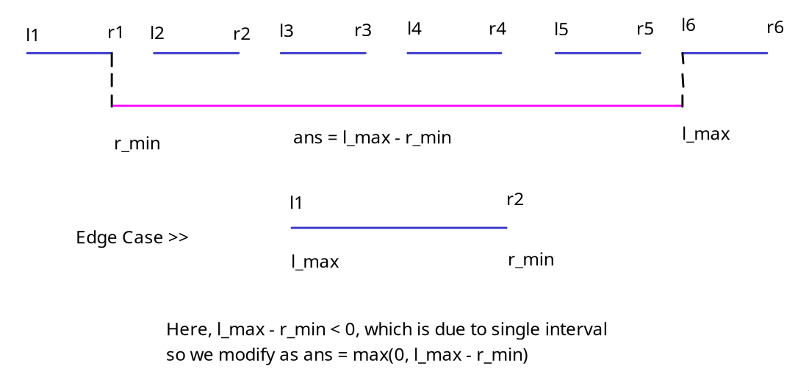

# Coder’s Club Chapter #01 Editorial

By [***Precizne***](https://codeforces.com/profile/Precizne), 04 February 2024 18:49

## A. Another Company

From the question, we basically understand that we need to find such values $x$ and $y$ such that

- $y \le x$
- $x \cdot y = n$ for the given $n$
- $|x - y|$ should be as minimum as possible
    
    From above we get that $x$ and $y$ must be divisors of $n$. Thus, we can iterate over all divisors $d$ of $n$ in $O(\sqrt{n})$ and select the pair $x$ and $y$ as $d$ and $n / d$ respectively such that the above requirements are satisfied.
    
    ```cpp
    void solve() {
       int n;
       cin >> n;
       int m = sqrt(n);
       for(int i = m; i >= 1; i--) {
          if(n % i == 0) {
             cout << min(i, n / i) << " " 
    				  << max(i, n / i) << endl;
             return;
          }
       }
    }
    ```
    

## B. Borrowing Sticks

Let’s arrange the sticks on a number line. They can be seen as segments/intervals like $(l_1, r_1), (l_2, r_2), ..., (l_n, r_n)$ on it. We need our single stick to reach the right end of the leftmost segment $r_{min}$ and left end of the rightmost segment $l_{max}$ as shown in the diagram. In this way, we can ensure we cover all segments with the minimum length. As an edge case, for a single segment, we don’t need any sticks. Therefore, the answer is $max(0, l_{max} - r_{min})$ and can be easily found in $O(n)$.



```cpp
void solve() {
   int n;
   cin >> n;
   vector<int> l(n), r(n);
   for(int i = 0; i < n; i++) {
      cin >> l[i] >> r[i];
   }
   int l_max = *max_element(l.begin(), l.end());
   int r_min = *min_element(r.begin(), r.end());
   cout << max(0ll, l_max - r_min) << endl;
}
```

## C. Can Feebo Do It?

Let’s first understand how our algorithm behaves. Whenever there is an “ab”, it changes to “bba”. Therefore, our algorithm doesn’t stop whenever there is a “a” on the left of “b”. After our algorithm ends, there are NO “a” on the left of any b.

Imagine in this string “abbbbb”, the single “a” operates on all those “b”s on its right. Therefore, we must count number of “b”s as $b_{num}$ before we encounter an “a”. We add this count to the number of operations $ops$ happening.

Now let’s focus on what happens after one operation, the number of “b”s double. Therefore, whenever we encounter an “a” we must double the count of “b”s as $b_{num} \to 2 \cdot b_{num}$. Using these rules, we operate from right to left. One must take case that the number can go well beyond long long int, so we must modulo the numbers with $10^9+7$ after every operation.

```cpp
void solve() {
   string s;
   cin >> s;
   int M = 1e9 + 7;
   int ops = 0;
   int b_num = 0;
   for(int i = s.length() - 1; i >= 0; i--) {
      if(s[i] == 'b') {
         b_num++;
         b_num %= M;
      }
      else {
         ops += c;
         ops %= M;
         b_num *= 2;
         b_num %= M;
      }
   }
   cout << ans << endl;
}
```

## D. Deimos And Phobos Gifts

Let’s list out the appearance of each possible value of $a_i$ for every operation, denote occurrence as $1$ and absence as $0$. Let’s focus on just one value for example $a_i = 1$ in the second image. An occurrence of $1$ is counted when we pair up two arrays with at least one of them having an occurrence of 1. In other words, if we pair up two arrays with none having an occurrence of $1$ then it does NOT count towards the answer. The same we do for every value of $a_i$ $(1 \le a_i \le n + k)$.

Thus, in the first image, we need to count all pairs of $(0, 1), (1, 0), (1, 1)$, or simply, (total number of pairs) $-$ (pairs of $(0, 0)$) for every $a_i$. In the examples below, the answers turns up to be $44$.


But question isn’t over yet. $n$ and $k$ both range as $(1 \le n, k \le 2 \cdot  10^5)$. If we count occurrences for every possible value every operations, we are going to get a TLE as it goes $O(k(n+k))$. This, however, can be prevented be storing the last occurrence of a value before it is replaced in an operation in a map. Only when that value reappears in an operation, we subtract the last occurrence from the current one to get number of operations the value was absent and add it to its total number of absences. This avoid doing operations on all possible $(n+k)$ values. This can be done in $O(k\log(n + k))$ using map.

```cpp
void solve() {
   int n, k;
   cin >> n >> k;
   vector<int> a(n);
   map<int, int> prv, cnt;
   for(auto& i : a) {
      cin >> i;
      prv[i] = -1;
   }
   for(int i = 1; i <= k; i++) {
      int p, v;
      cin >> p >> v;
      prv[a[p - 1]] = i;
      a[p - 1] = v;
      cnt[a[p - 1]] += i - prv[a[p - 1]];
      prv[a[p - 1]] = -1;
   }
   for(int i = 1; i <= n + k; i++) {
      cnt[i] += (prv[i] != -1) ? (k + 1) - prv[i] : 0;
   }
   int ans = 0;
   for(int i = 1; i <= n + k; i++) {
      ans += k * (k + 1) / 2 - cnt[i] * (cnt[i] - 1) / 2;
   }
   cout << ans << endl;
}
```

## E. Err, I’m Sorry

This question can be done using a Dynamic Programming. We observe that the array values are pretty small (up to $63$) and the AND values will be (up to $63$) as well. Thus, we can count the number of sub-sequences that have an AND value equal to $v$ for $\forall v \in [0, 63]$. Since $a_i$ is small $(0 \le a_i \le 63)$ or $(0 \le m \le 6)$, we can go for a $O(n\cdot2^m)$ DP.

**DP STATE:** We define the DP state as $dp[i][j]$ where it represents the number of sub-sequences using the first $i$ elements that have a total AND value of $j$.

**DP TRANSITION:** We have 3 types of DP transitions, two of which are Binary Choice:

- We encounter a new element $i$ and start a new sub-sequence with just the $i$-th element.
$dp[i][j] = dp[i][j] + 1$
Here, we increase the count of sub-sequences of current set by 1.
- We choose to **NOT TAKE** $i$-th element in current count.
$dp[i][j] = dp[i][j] + dp[i - 1][j]$
Here, we don’t take the current element. Thus, the count of sub-sequences of current set is increased by that of previous set of elements with the **same** AND value.
- We choose to **TAKE** $i$-th element in current count.
$dp[i][j \& a[i]] = dp[i][j \& a[i]] + dp[i - 1][j]$
Here, we take the current element. Thus, the count of sub-sequences of current set with a **modified** AND value is increased by that of previous set of elements with an **unmodified** AND value.

Normally, for all possibilities, we would have summed up the values of $dp[n][j]$ for $\forall j \in [0, 63]$. Alternatively, if we wanted number of sub-sequences with AND value $v$, we would gone for $dp[n][v]$. The answer, however, requires only sub-sequences with AND value having $k$ set bits. Therefore, we just iterate over $j \in [0, 63]$ and check number of set bits in $j$. If it is equals to $k$, we add its DP value to the final answer. In other words, we find $\sum dp[n][j]$ for $\forall j \in [0, 63]$ such that $setbits(j) = k$.

One must take case that the number can go well beyond long long int, so we must modulo the numbers with $10^9+7$ after every operation.

```cpp
void solve() {
   int n, k, M = 1e9 + 7;
   cin >> n >> k;
   vector<int> a(n);
   for(auto& i : a) {
      cin >> i;
   }
   vector dp(n + 1, vector<int>(64, 0));
   for(int i = 1; i <= n; i++) {
      dp[i][a[i - 1]] += 1;
      dp[i][a[i - 1]] %= M;
      for(int j = 0; j <= 63; j++) {
         dp[i][j] += dp[i - 1][j];
         dp[i][j] %= M;
         dp[i][j & a[i - 1]] += dp[i - 1][j];
         dp[i][j & a[i - 1]] %= M;
      }
   }
   int ans = 0;
   for(int i = 0; i <= 63; i++) {
      if(popcount((unsigned int)i) == k) {
         ans += dp[n][i];
         ans %= M;
      }
   }
   cout << ans << endl;
}
```

## F. Foni Mazik

This question is a really fun one as it is not like any other question in this editorial. This question utilizes a **Randomized Algorithm**. Before all that, let’s first understand how the permutations behave.

A permutation is simply just a rearrangement of elements. Formally, a permutation of a set $S$ is defined as a bijection (one-one and onto) from $S$ to itself as shown below.


As per the question, we are given a permutation $a$ of length $n$. We need to generate two permutations $p$ and $q$, if possible, such that $p$ and $q$ have **no fixed points** and $a[p[q[i]]] = i$. We will think about checking for fixed points later. For now, let’s see how we can generate permutations $p$ and $q$.

**GENERATING $q$ GIVEN $p$:** Trivially, we can brute force $p$ and $q$ but this will TLE for higher values of $n$. Let’s assume we somehow were able to generate a valid permutation $p$, can we get permutation $q$ deterministically? Yes. Since permutations are bijective, we can map them to generate the missing one. Our mapping is simply $a[p[q[i]]] = i$. Let’s take $a = \left[ 5, 1, 4, 2, 3 \right]$ as an example. Here, we have $a$ and $i$. If we can somehow generate $p$, we can get easily get $q$ as $q[a[p[i]]] = i$. This can be obtained as:

- First modifying $a[p[q[i]]] = i \to q[a[p[q[i]]]] = q[i]$ by taking q both sides
- Finally ending up with $q[a[p[i]]] = i$ by replacing $q[i]$ with $i$


**GENERATING $p$:** Now that we know how to generate $q$ given we have $p$, we need to find a method to generate $p$ such that $p$ and $q$ have no fixed points. In mathematics, permutations like $p$ and $q$, that have **no fixed points,** are knows as **derangements**. Simply, a derangement $p$ is a permutation that has no fixed points, that is $\forall i$ : $p_i \neq i$. Therefore, we infinitely loop and try to generate a permutation $p$ randomly until both $p$ and $q$ satisfy derangement property. If an answer exists, then we break out of the loop and output both $p$ and $q$.

**BOUNDING OPERATIONS:** What happens when **no** answer exists? Our algorithm runs infinitely and definitely gives a TLE. We need to stop our loop after certain number of operations. This is decided at number after which we are pretty sure that no answer will likely exists. What is the probability that a derangement does not exist/occur? It is known that the probability for any randomly chosen permutation to be a derangement is roughly $e^{-1}$. This is beautifully proven here.

[https://math.ucr.edu/home/baez/permutations/permutations_1.html](https://math.ucr.edu/home/baez/permutations/permutations_1.html)

For two such permutations $p$ and $q$, the probability is about $e^{-2}$ which is more than $\frac{1}{9}$. We can safely bound our operations at a probabilistic value of $\gt 150$. If you are lucky, even $100$ sometimes works while values around $500$ are more than safe. The higher your value, the higher is your runtime but lower is your chances of having a WA.

**OVERVIEW:** Generate $p$ randomly. Uniquely determine $q$ from $p$. Check if neither $p$ nor $q$ have any fixed points. If they do, rinse and repeat until successful. If successful, declare **possible** and print $p$ and $q$. If not successful within 500 operations, declare **impossible.**

```cpp
bool hasFP(vector<int>& a, int n) {
   for(int i = 0; i < n; i++) {
      if(a[i] == (i + 1)) {
         return true;
      }
   }
   return false;
}

void solve() {
   int n;
   cin >> n;
   vector<int> a(n);
   for(auto& i : a) {
      cin >> i;
   }
   vector<int> p(n), q(n);
   iota(p.begin(), p.end(), 1ll);
   mt19937 rng(chrono::steady_clock::now()
               .time_since_epoch().count());
   int ops = 0;
   while(ops < 500) {
      shuffle(p.begin(), p.end(), rng);
      for(int i = 0; i < n; i++) {
         q[a[p[i] - 1] - 1] = i + 1;
      }
      if(!hasFP(p, n) && !hasFP(q, n)) {
         cout << "Possible" << endl;
         for(auto i : p) {
            cout << i << " ";
         }
         cout << endl;
         for(auto i : q) {
            cout << i << " ";
         }
         cout << endl;
         return;
      }
      ops++;
   }
   cout << "Impossible" << endl;
}
```
